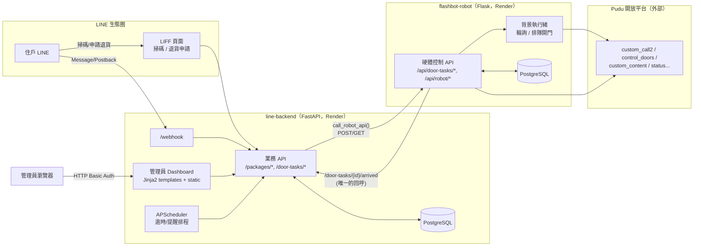
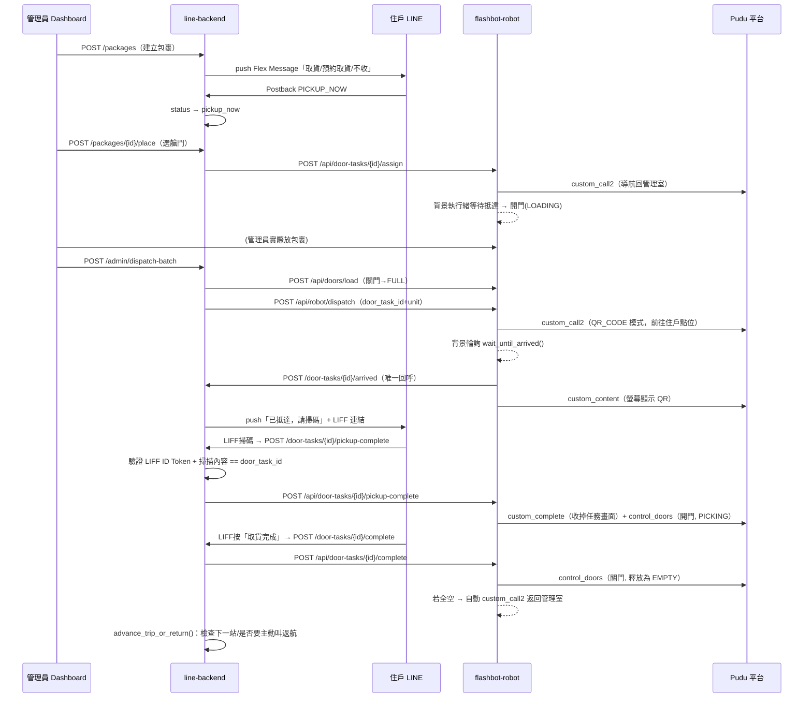
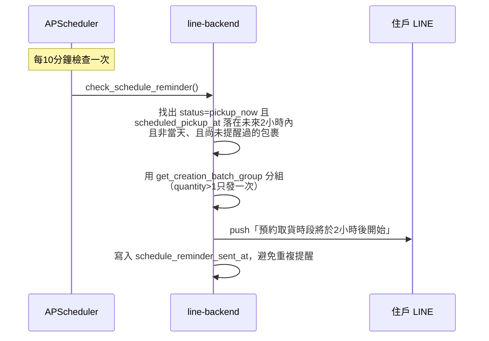

# Aurobox 開發文件（Development Documentation）

> 依 `github.com/stephanieyenyu/AMR-System` repo `main` branch 目前實際內容撰寫。

---

## 1. 專案概述

**Aurobox** 是一套社區型 AMR（Autonomous Mobile Robot）包裹配送系統：

- 管理員透過 Web Dashboard 登記包裹
- 住戶完全透過 **LINE 官方帳號**收到到貨通知、選擇取貨方式、掃碼開門、確認取貨/退貨，不需要另外安裝 App
- **機器人（Pudu Flashbot 硬體）**負責實際移動、艙門開關、螢幕顯示 QR Code，透過 Pudu 開放平台 API 被遠端控制

系統是單一 repo 底下的兩個資料夾：

| 資料夾 | 職責 |
|---|---|
| `line-backend/` | **唯一的業務邏輯與狀態真相來源**：包裹狀態機、LINE 對話、管理員 Dashboard、排程逾時/提醒處理 |
| `flashbot-robot/` | 只負責「收指令、操作硬體」：艙門開關、呼叫 Pudu API 導航、機器人狀態查詢 |

`line-backend` 和`flashbot-robot`，兩者**沒有共用資料庫**，純粹透過 HTTP RESTful API（JSON）溝通。目前部署在 **Render**，`line-backend`、`flashbot-robot` 各自是獨立的 Web Service。

---

## 2. 系統架構與資料流

### 2.1 通訊協定總覽



重點：
1. **`line-backend → flashbot-robot`**：`main.py` 裡的 `call_robot_api()` 統一封裝，含 timeout、重試、失敗寫入 `TaskLog`，目標網址由 `ROBOT_API_BASE_URL` 決定。
2. **`flashbot-robot → line-backend` 的回呼只有一個**：機器人抵達後，`tasks.py` 的 `_poll_notify_display_qr()` 主動 POST 到 `{CENTRAL_API_BASE_URL}/door-tasks/{door_task_id}/arrived`。
3. 其餘狀態確認是 `line-backend` 主動輪詢機器人的 `GET /api/dashboard/status`（`poll_robot_returned()` 排程，每 20 秒）。
4. **在 Render 上，`ROBOT_API_BASE_URL`/`CENTRAL_API_BASE_URL` 直接填對方服務的 `https://xxx.onrender.com` 網址**，兩個都是固定網址，不需要 ngrok。
5. 兩邊資料庫完全獨立，可以共用同一個 Postgres 執行個體，但驅動不同：`line-backend` 用 `postgresql+psycopg://`（psycopg3），`flashbot-robot` 用 `postgresql://`（psycopg2）。

### 2.2 完整資料流程：從「住戶在 LINE 下指令」到「機器人動作」



其他分支流程：
- **拒收/逾時未取**：住戶按「拒收」或 8 分鐘未動作 → 狀態轉 `rejected_at_door`/`returned_timeout` → 呼叫機器人 `POST /api/door-tasks/{id}/cancel` → `advance_trip_or_return()` 決定下一站或返航
- **不收（到貨通知當下直接拒絕）**：`status = voided`，不涉及機器人動作
- **退貨**：住戶透過 LIFF（`/liff/return-request`）建立 `task_type=return` 包裹，走相同的艙門分配/派送/掃碼流程，方向相反
- **緊急召回**：管理員按「返回管理室」→ 機器人判斷是否正在服務住戶，是則排入佇列等流程結束再召回，否則立即取消任務並返航

**新增的預約提醒流程**：



**排程任務總覽**：

| 排程函式 | 週期 | 用途 |
|---|---|---|
| `check_pickup_timeout` | 1 分鐘 | 送貨 `arrived` 超過 8 分鐘未取貨 → 自動觸發拒收流程 |
| `check_schedule_reminder` | 10 分鐘 | 預約非當天時段取貨，時段前 2 小時提醒收件人一次 |
| `check_assign_timeout` | 1 分鐘 | 艙門分配了但管理員沒裝載 → 逾時釋放艙門 |
| `check_return_timeout` | 1 分鐘 | 退貨/拒收開門檢查超過 8 分鐘沒關門 → 強制關門 |
| `poll_robot_returned` | 20 秒 | 輪詢機器人是否已回到管理室 |
| `check_stuck_dispatch` | 2 分鐘 | 安全網：避免派送下一站失敗讓整批卡死 |

**色彩系統/危險操作的視覺語言**（貫穿 Dashboard 跟 LINE 端）：
- 一般操作按鈕：中性深灰 `#2c2c2a`
- 會直接驅動硬體或不可逆的操作（全部派送、召回機器人、刪除、銷案）：品牌紅 `.danger` class，紅色**只保留給這一種按鈕**
- 次要操作：白底灰邊框 `.secondary` class
- 這套語言同時套用在 Dashboard（`base.css`）跟 LINE Flex Message 按鈕（`line_messaging.py` 的 `_flex_button()`）

---

## 3. 模組開發說明

### 3-1 LINE & Dashboard 端（`line-backend/`）

**框架與套件**：FastAPI + Uvicorn、SQLAlchemy 2.x + PostgreSQL（`psycopg[binary]`）、`line-bot-sdk` v3（`WebhookParser`、`MessagingApi`、`FlexMessage`、LIFF）、APScheduler（`BackgroundScheduler`）、`pydantic-settings`、`jinja2`（管理頁面樣板用）。

#### 管理員 Dashboard：Jinja2 樣板 + 靜態檔

四個管理頁面（Dashboard、每日報表、例外處理、住戶綁定管理）的 HTML/CSS/JS 都是獨立檔案，不是內嵌在 `main.py` 裡：

```
line-backend/app/
  templates/
    _base.html       ← 共用版面骨架（<head>、頁首、共用JS引入）
    _nav.html         ← 共用導覽列（current_page 變數決定哪個是「目前頁面」）
    dashboard.html
    reports.html
    exceptions.html
    residents.html
  static/
    css/
      base.css        ← 四頁共用樣式（顏色系統、按鈕、表格、狀態徽章、modal...）
      dashboard.css    ← Dashboard 頁專屬樣式（機器人狀態卡、艙門顯示、建立包裹表單）
    js/
      common.js        ← 共用工具函式（withButtonFeedback：按鈕loading狀態包裝）
      dashboard.js      ← 建立包裹、包裹清單、機器人狀態、艙門操作、篩選
      reports.js        ← 每日報表查詢、任務時間軸翻頁
      exceptions.js     ← 退回/作廢包裹清單、銷案、重新派貨
      residents.js      ← 住戶綁定清單、修改、刪除
```

FastAPI 端的對應寫法：
```python
templates = Jinja2Templates(directory="app/templates")
app.mount("/static", StaticFiles(directory="app/static"), name="static")

@app.get("/admin", response_class=HTMLResponse, dependencies=[Depends(require_admin_auth)])
async def admin_dashboard_page(request: Request):
    return templates.TemplateResponse("dashboard.html", {
        "request": request,
        "current_page": "dashboard",
        "page_title": "FlashBot Dashboard",
        "robot_home_point_name": settings.ROBOT_HOME_POINT_NAME,
    })
```
其餘三頁（`/admin/reports`、`/admin/exceptions`、`/admin/residents`）寫法相同，只是樣板名稱、`current_page`、`page_title` 不同。`main.py` 本身只留路由與業務邏輯，不含 HTML/JS 字串。

#### 三個共用化的地方（新功能要沿用，不要重寫一份）

1. **門牌篩選**：Dashboard 的包裹清單篩選是「門牌輸入框 + 日期起訖」合併成一組「套用/清除全部」，後端 `/admin/packages` API 支援 `unit`、`date_from`、`date_to` 三個可選參數，前端只打這一支 API，不會有第二套結果渲染邏輯。
2. **通知住戶**：`completed` 狀態、還沒通知過的包裹，「操作」欄直接顯示「通知住戶」按鈕，不需要另開視窗選門牌/包裹。
3. **推播給收件人的共用函式**（`main.py`）：
   ```python
   def _push_to_recipients(db: Session, package: Package, message: str, log_context: str) -> dict:
       """把同一則文字訊息推播給這筆包裹的所有收件人，統計成功/失敗數，
       失敗的每一筆都寫一筆task_log存證。"""
   ```
   `send_pending_pickup_notification`（自動觸發的逾時/拒收提醒）、`notify_completed_leftover`（Dashboard 手動補通知）、`check_schedule_reminder`（預約提醒）都呼叫這一支，不各自寫迴圈。**任何新功能要「推播文字給包裹收件人」，都應該呼叫這支函式。**

#### LINE Flex Message 按鈕系統（`line_messaging.py`）

原生 LINE `type: button` 元件的 `secondary` 樣式沒辦法自訂邊框顏色，改用 `type: box` 自己畫，統一由共用函式產生：
```python
BUTTON_PRIMARY_COLOR = "#2c2c2a"
BUTTON_SECONDARY_BG = "#FFFFFF"
BUTTON_SECONDARY_BORDER = "#D0D0CC"
BUTTON_SECONDARY_TEXT = "#444444"

def _flex_button(action: dict, style: str = "primary") -> dict:
    """style="primary"：深灰底白字；style="secondary"：白底灰邊框深灰字"""
```
`push_arrival_notification`（到貨通知）、`push_arrived_notification`（抵達通知）的按鈕都呼叫這支函式產生，**新增任何 Flex Message 按鈕都應該用它，不要手刻原生 `button` 元件**，否則外觀會跟系統其他地方不一致。

#### 關鍵檔案位置

| 檔案 | 內容 |
|---|---|
| `app/main.py` | 業務邏輯、路由、Webhook 事件分派、排程任務（不含 HTML/JS） |
| `app/models.py` | `Package`（核心狀態機）、`LineBinding`（門牌綁定，`line_user_id`為主鍵）、`PackageRecipient`、`TaskLog` |
| `app/line_messaging.py` | LINE Flex Message 建構（含共用按鈕函式）、push/reply 封裝 |
| `app/line_verify.py` | LIFF ID Token 驗證（呼叫 LINE 官方 `oauth2/v2.1/verify`） |
| `app/config.py` | 環境變數設定（`pydantic_settings.BaseSettings`） |
| `app/db.py` | SQLAlchemy engine / `SessionLocal` |
| `app/init_db.py` | 一次性建表腳本（`python -m app.init_db`） |
| `app/templates/*.html` | 四個管理頁面樣板 + 共用骨架/導覽列 |
| `app/static/css/*.css`、`app/static/js/*.js` | 樣式與前端互動邏輯 |
| `migrate_add_*.py`（`line-backend/` 根目錄） | 一次性資料庫欄位遷移腳本，跑過就可以刪掉 |

**核心資料模型 `Package` 狀態機**：
```
pending → pickup_now → delivering → arrived → completed
                                        ├──▶ rejected_at_door（拒收 / 退貨取消）
                                        └──▶ returned_timeout（逾時未取）
pending → voided（到貨當下直接不收）
```

**`door_task_id`**：同一位收件人、同一次派送如果用到不只一扇門，這些包裹共用同一組 `door_task_id`（UUID），所有機器人回呼/掃碼/完成/拒收都以此為單位一次處理整組。同一戶如果同時有送貨與退貨兩個任務，是兩個獨立的 `door_task_id`（`task_type` 不同）。

**`creation_batch_id`**：建立包裹時 `quantity > 1`，同一批 N 筆包裹共用這個 ID，只發一次到貨通知，但住戶按取貨/預約/不收時要一次套用到整批（`get_creation_batch_group()` 處理這個分組邏輯）。

### 3-2 機器人與 Pudu API 端（`flashbot-robot/`）

**框架與套件**：Flask + Flask-SQLAlchemy、`psycopg2-binary`（沒設定 `DATABASE_URL` 時退化為本機 SQLite `instance/aurobox.db`）、`hashlib`/`hmac`（Pudu HMAC-SHA1 簽章）。

**如何與 Pudu 機器人建立連線**：`src/aurobox/pudu_client.py` 的 `PuduApiClient` 是唯一直接呼叫 Pudu Open Platform（`https://css-open-platform.pudutech.com`）的地方。每個請求都會：
1. 用 `x-date`（UTC 時間）與（POST 時）`Content-MD5` 組出簽章字串
2. 用 `app_secret`（`Pd_secret`）以 HMAC-SHA1 簽章，包在 `Authorization` 標頭送出
3. `app_key`（`Pd_key`）與 `shop_id`（`Aurotek_id`）識別呼叫方與場域

**`PuduApiClient` 提供的低階方法**（`pudu_client.py`）：

| 方法 | 對應 Pudu API | 用途 |
|---|---|---|
| `get_by_sn1` / `get_by_sn2` | `GET v1/status/get_by_sn`、`GET v2/status/get_by_sn` | 機器人即時狀態 |
| `get_task_state` | `GET v1/robot/task/state/get` | 任務狀態 |
| `get_position` | `GET v1/robot/get_position` | 座標位置 |
| `get_map_list` / `open_map` | `GET map-service/v1/open/list`、`GET map-service/v1/open/map` | 地圖清單/開啟地圖 |
| `recharge` | `GET v2/recharge` | 回充電站（僅艙門皆空時允許） |
| `custom_call` / `custom_call2` | `POST v1/custom_call` | 導航指令：叫機器人前往管理室/住戶點位/充電站，可帶 `call_mode='QR_CODE'` |
| `custom_content` | `POST v1/custom_content` | 切換機器人螢幕畫面（顯示取件 QR Code） |
| `custom_complete` | `POST v1/custom_call/complete` | 收掉/清除目前任務畫面 |
| `custom_call_cancel` | `POST v1/custom_call/cancel` | 中斷目前任務（緊急召回、逾時取消時使用） |
| `control_doors` | `POST v1/control_doors` | 批次開關艙門 |
| `get_door_state` | `GET v1/door_state` | 查詢硬體回報的門狀態 |

每一次呼叫都會寫進 `instance/robot_commands.log`（`_create_robot_command_logger`），對排查「機器人到底收到什麼指令、Pudu 回了什麼」很關鍵。

**`FlashbotController`（`robot.py`）：業務語意層**，包住 `PuduApiClient`：
- `get_status_summary()`：同時打 v1/v2/task-state 三個來源、各自 `try/except` 容錯，合併出穩定欄位（`state`/`move_state`/`run_state`/`is_charging`/`battery_level`/`current_location`）——**上層所有程式碼（輪詢、Dashboard 狀態顯示）都吃這個合併後的結果**，不直接讀某一個原始來源
- `wait_until_arrived()`：輪詢直到抵達（`timeout_seconds`/`poll_interval` 可調）
- `control_doors()`：邏輯門→實體門映射（3 門/4 門相容設計，見下方）

**3 門/4 門相容設計**：`DOOR_MODE=3_DOORS` 時，邏輯上的 `H_01` 會同時對應實體的 `H_01`+`H_02` 兩扇門，對上層 `line-backend` 完全透明——`line-backend` 永遠只看到邏輯門號，不需要知道現場是 3 門還是 4 門櫃體。

**關鍵檔案位置**：

| 檔案 | 內容 |
|---|---|
| `src/aurobox/app.py` | Flask app factory（`create_app`）：資料庫初始化、艙門預設值重置、Blueprint 註冊 |
| `src/aurobox/api.py` | 所有 HTTP 路由（`api_bp`）：`/door-tasks/{id}/assign`、`/doors/load`、`/robot/dispatch`、`/door-tasks/{id}/pickup-complete`、`/door-tasks/{id}/complete`、`/door-tasks/{id}/cancel`、`/door-tasks/return`、`/doors/return-open`/`return-complete`/`return-timeout`、`/dashboard/status`、`/robot/recall`、`/robot/recharge` |
| `src/aurobox/robot.py` | `FlashbotController`：業務語意層 |
| `src/aurobox/pudu_client.py` | `PuduApiClient` + `PuduAuth`：低階 HTTP 呼叫與 HMAC 簽章 |
| `src/aurobox/services.py` | `update_robot_state()`、`check_and_return_home_if_empty()`（艙門皆空時自動觸發返航） |
| `src/aurobox/tasks.py` | 背景執行緒：`_queue_door_action`（統籌開/關門順序）、`_poll_notify_display_qr`（輪詢抵達→回呼中央大腦→顯示QR）、`_wait_and_execute_recall`（排隊召回） |
| `src/aurobox/models.py` | `Door`（`sn`+`door_number`唯一，狀態：`empty/assigned/loading/full/picking/putting`）、`RobotState`（`sn`唯一，`last_point`、`current_task_id`） |
| `src/aurobox/utils.py` | `build_custom_call_payload()`：組出 Pudu `custom_call2` 標準 payload |
| `src/aurobox/config.py` | 讀取 Pudu/DB 相關環境變數 |
| `src/aurobox/cli.py` | 命令列工具，手動測試單一 Pudu API |
| `run.py` | 程式進入點 |

---

## 4. 部署與環境設定

兩個服務目前部署在 **Render**，各自是獨立的 Web Service（**手動建立，不是用 `render.yaml` 的 Blueprint 功能**——這個檔案雖然放在 repo 根目錄，但服務不是用 Blueprint 建立的，Render 不會去讀它，目前純粹是文件用途）。

完整的從零建立步驟（建資料庫、建兩個 Web Service、環境變數清單、LINE Developers Console 設定），寫在 repo 根目錄的《Render部署指南.md》；系統部署好之後日常怎麼使用，寫在《Render使用說明.md》。這裡列的是開發時要記住的關鍵事實：

1. **兩個服務可以共用同一個 PostgreSQL**，但 `DATABASE_URL` 前綴不同：`line-backend` 用 `postgresql+psycopg://`（psycopg3），`flashbot-robot` 用 `postgresql://`（psycopg2）。
2. **`flashbot-robot`用 `pyproject.toml`，Build Command 要用 `pip install .`。
3. **`flashbot-robot` 的 Start Command 一定要帶 `--port $PORT`**（`python run.py --host 0.0.0.0 --port $PORT`）。
4. **`flashbot-robot` 的環境變數名稱是 `Pd_key`/`Pd_secret`/`Aurotek_id`/`FLASHBOT_SN`**。
5. **目前方案（Starter）沒有 Shell、也沒有 Pre-Deploy Command**，跑一次性腳本（例如新增欄位的 migration）要暫時把指令接在 Build Command 後面、部署一次、確認成功、再改回去：
   ```
   pip install -r requirements.txt && python migrate_add_某欄位_column.py
   ```
6. **Render 給的網址固定、永久有效**（`https://xxx.onrender.com`），不需要處理 ngrok 網域變動的問題。

**LINE 官方帳號需要設定的三個 URL**（一次性設定，網域不變就不用再改）：
- Webhook URL：`https://你的line-backend網址.onrender.com/webhook`
- LIFF App「掃碼取貨」Endpoint URL：`https://你的line-backend網址.onrender.com/liff/scan`
- LIFF App「退貨申請」Endpoint URL：`https://你的line-backend網址.onrender.com/liff/return-request`

---

## 5. 未來開發與除錯指南

### 5.1 新增管理頁面功能該改哪裡
1. 改**畫面**：對應的 `app/templates/*.html`，共用樣式改 `base.css`，該頁專屬樣式放進該頁自己的 CSS
2. 改**互動邏輯**：對應的 `app/static/js/*.js`
3. 新增**業務 API**：`main.py` 加路由，回傳 JSON
4. **危險/硬體操作按鈕加 `.danger` class**，一般操作用預設樣式，不要手動指定顏色
5. 需要「推播文字通知給包裹收件人」：呼叫 `_push_to_recipients()`，不要重新寫迴圈

### 5.2 新增機器人動作該改哪裡
1. `pudu_client.py` 新增低階 API 呼叫（若 Pudu 本身有對應 API）
2. `robot.py` 的 `FlashbotController` 加業務語意方法包住上一步
3. `api.py` 新增 Flask route，呼叫上一步方法，更新本地 `Door`/`RobotState`
4. 若需要「等機器人抵達才動作」，仿照 `tasks.py` 的 `_queue_door_action` 模式，用背景執行緒
5. `line-backend` 的 `main.py` 新增對應的 `call_robot_api()` 呼叫點

### 5.3 新增 Flex Message（LINE 端訊息）
- 按鈕一律透過 `_flex_button()` 產生，不要手刻原生 `type: button`
- 說明文字盡量精簡，住戶不需要知道的實作細節不要放進通知

### 5.4 新增資料庫欄位
1. 對應的 `models.py` 加 `Column` 定義
2. `line-backend/` 根目錄新增一次性 migration script：
   ```python
   from app.db import engine
   from sqlalchemy import text

   with engine.begin() as conn:
       conn.execute(text("ALTER TABLE 表名 ADD COLUMN IF NOT EXISTS 欄位名 型別"))
   print("欄位新增完成")
   ```
3. **部署新程式碼跟執行 migration 要同一次部署完成**（Build Command trick），不要分兩次——先上會查詢新欄位的程式碼、欄位卻還沒建立，會直接 500（`UndefinedColumn`）
4. 確認成功後把 Build Command 改回 `pip install -r requirements.txt`

### 5.5 測試/除錯注意事項
- **驗證修改的標準流程**：`ast.parse` 語法檢查 → `pyflakes`（能抓到未定義變數等 `ast.parse` 抓不到的問題）→ JS 用 acorn 驗證語法 → 實際起測試用伺服器、用建過表的資料庫打過所有路由確認 200
- **一個人測試多點派送**：`LineBinding.line_user_id` 是主鍵，一個 LINE 帳號同時只能綁一個門牌。做法：綁定 A 門牌 → 建 A 包裹 → 住戶綁定管理頁面把自己的綁定改成 B 門牌 → 建 B 包裹。`line_user_id` 在包裹建立當下就存進 `Package` 表，換綁不影響已建立包裹的通知對象
- **`unit` 會直接當成機器人導航目的地**（`/api/robot/dispatch` 的 `unit` 參數），測真實機器人的多點派送，門牌名稱要對應機器人地圖上真實存在的點位；用 mock 環境測試沒有這個限制